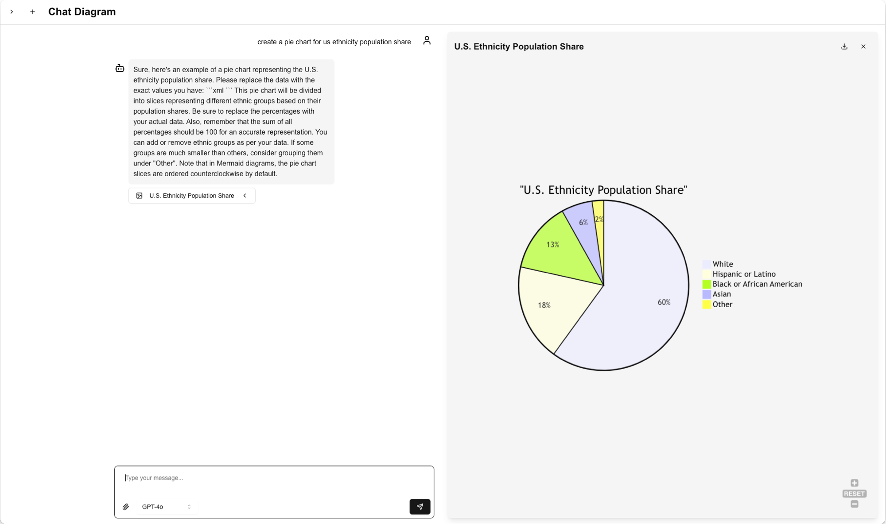

# Artifact Generation Through Chat 

## Project Overview

The project is a Next.js application that uses AI to generate various types of artifacts through a chat interface. The core components are:
- SEO-optimized landing pages （主要SEO页面类型）
- Artifact generation system （定义了App产出的workpiece的类型）
- Internationalization i18n support （多语言支持）
- CMS integration - Airtable （CMS内容管理&生成）





## Development Handbook
> This playbook will help you adapt the Chat Diagram codebase to create your own artifact generation application (e.g., document generator, table creator, presentation maker, etc.).

> 通过完成以下任务，你可以将该项目改造成任何 GPT Wrapper, 如：Diagram Generator, Job Description Generator, Essay Writer, Slides Generator, etc.

### Part 1: SEO & Website Structure

- [ ] Define Pages - 自定义SEO页面 
    Recommend V0 for component generatetion 建议用V0直接生成以下页面
    - [ ] [Landing Page](components/seo-pages/landing-page.tsx) - 官网 - [V0](https://v0.dev/chat/lTVGbKnR468?b=b_6ysZClex5Wx)
    - [ ] [Tool Landing Page](components/seo-pages/tool-landing-page.tsx) - 工具页面 - [V0](https://v0.dev/chat/mkKcL2GGJD3)
    - [ ] [Template Landing Page](components/seo-pages/template-landing-page.tsx) - 模板页面 - [V0](https://v0.dev/chat/umiI3lqkPgg?b=b_Pzawq99zA1b)
    - [ ] [Tool Collection](components/seo-pages/tool-collection.tsx) - 工具集合页面 
    - [ ] [Template Collection](components/seo-pages/template-collection.tsx) - 模板集合页面 - [V0](https://v0.dev/chat/sqKwPtG3GIR?b=b_4ygovrHkZv8)
- [ ] Add all English content from new components to `public/locales/en.json` for internationalization - 新增组件更新英文部分的内容
- [ ] Setup CMS - Airtable (and update content data structure if you are not using default) - 在Airtable 上设置工具、模板页面内容


### Part 2: Product Development
- [ ] Define Artifact System (optional) - 定义App产出的workpiece的类型 (reference: components/artifact/artifact-panel.tsx)
- [ ] Update System Prompt - 更新生成 workpiece 的系统提示词

### Part 3: Before Deployment
- [ ] Generate all language translations usign `yarn translate` - 一键翻译页面内容
- [ ] Set new domain in `next-sitemap.config.mjs` - 设置新域名
- [ ] Set plausible and Google Analytics - 设置plausible和Google Analytics
- [ ] Set environment variables in `.env.local` - 设置环境变量
    ```env
    AIRTABLE_API_KEY=your_api_key
    AIRTABLE_BASE_ID=your_base_id
    OPENAI_API_KEY=your_openai_key
    SITE_URL=your_domain
    ```


## More Details
- this project uses 11 languages including English, Japanese, Korean, Traditional Chinese, Spanish, French, Portuguese, German, Italian, Hebrew, and Arabic. - 该项目支持11种语言
- Project Structure
    ```
    /
    ├── app/ # Next.js app router
    ├── components/
    │ ├── artifact/ # Artifact type components
    │ ├── seo-pages/ # SEO-optimized page components
    │ └── ui/ # Shared UI components
    ├── lib/ # Core utilities
    └── public/ # Static assets & locales
    ```


## Acknowledgments

- Built with [Next.js](https://nextjs.org/)
- Diagrams powered by [Mermaid.js](https://mermaid.js.org/)
- AI capabilities by [OpenAI](https://openai.com/) & [Claude](https://www.anthropic.com/)
- CMS by [Airtable](https://airtable.com/)
- Styling with [TailwindCSS](https://tailwindcss.com/)
- Build by [V0](https://v0.dev/) & [Cursor](https://www.cursor.com/)

## Authors

- Victor Zhang - [@victorzhrn](https://github.com/victorzhrn)


