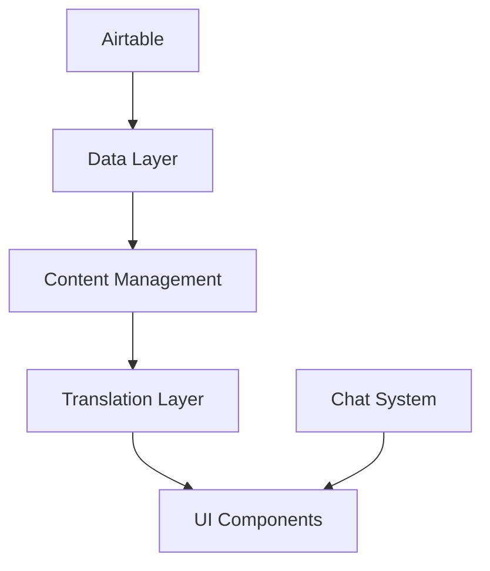

# Library Directory Documentation

## Overview
This directory contains core utilities and data management functions for the multilingual application with chat capabilities.

## Core Components

### Data Layer (`airtable.ts`)
- Central data source integration with Airtable
- Handles multilingual content structure (11 languages)
- Provides interfaces for tools and templates
- Implements CRUD operations with error handling

### Content Management
#### Templates (`templates.ts`)
- Template-specific data operations
- Default template structure and validation
- Conversion between Airtable and application formats

#### Tools (`tools.ts`) 
- Tool-specific data operations
- Similar structure to templates but with tool-specific fields
- Handles tool metadata and artifacts

### Chat System (`chat.ts`)
- Chat state management using localStorage
- Message handling with artifact support
- Chat history and persistence
- UI state management (sidebar, active chat)

### Internationalization
#### Translation Engine (`translate.ts`)
- AI-powered translation using GPT-4
- Handles JSON translation with formatting preservation
- Rate limiting and error handling
- Supports nested translation structures

#### Language Support (`languages.ts`)
- Language configuration and validation
- Translation imports and type definitions
- Helper functions for language handling

## Data Flow


## Key Features
- Multilingual support (11 languages)
- Persistent chat history
- AI-powered translations
- Template and tool management
- Artifact handling (diagrams, docs, slides)

## Environment Setup
Required environment variables:
```env
AIRTABLE_API_KEY=your_api_key
AIRTABLE_BASE_ID=your_base_id
```